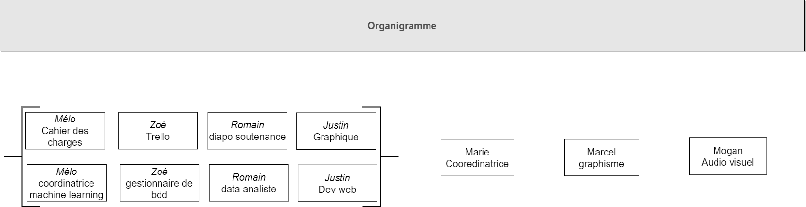

# marathon-du-web - Equipe 5
Projet sur une semaine en partenariat avec l'Université Montpellier 3 et NumeRev

## L'entreprise
Numerev est un projet associatif entre MSH-Sud et Lise Verlaet.
Il a pour but de mettre en œuvre un programme de recherche, action, développement. 
Développe un outils d’édition scientifique en open source.
Ils se démarquent via leur étapes d’élaboration d’articles.

### Pourquoi notre intervention :
L’outil est à l’état actuel capable de réaliser toute la partie éditoriale pour les auteurs.
L’outil s’oriente maintenant dans la partie lecteur dans ce but, Numerev nous confie la réalisation de la
preuve de concepts.

## Le besoin

Le projet Numerev entend développer une cartographie interactive des connaissances via l’exploitation
(datamining) des données issues des articles scientifiques et leur valorisation au sein d’une carte
conceptuelle interactive. L’interactivité de cette carte réside à la fois dans l’exploration des données
qu’elle contient, mais aussi dans sa fonction d’outil de navigation au sein du portail de ressources
Numerev (data/info-visualisation). Trois besoin en terme de data science/ dev :
- machine learning : extraire thème, domaines et concept.
- reporting : création d’une carte orienté graphe de la connaissance
- Base de données
  
Ainsi, nous nous positionnant dans le développement d’une fonctionnalité de l’outil dans le but d’aider les
lecteurs dans leur navigation/lecture des articles.
  
La maquette du site et la base de données sont en cours de conception et doivent encore être validés. 

## Rôles et tâches

### Gestion de projet
Gestion du trello : Zoé
Gestion du git : Mélody
Romain : Diapo de soutenance
Justin : documentation des besoins , graphiques, résumés 
### Développement
A définir

## Données fournies
- Extraction de 12 tables MySQL au format CSV. Ces tables comprennent les utilisateurs, auteurs, revue, publication, numéros et des mots clés.
- Schéma de la BDD + description
- Comprend une centaine d'articles et un peu plus de 2600 mots clés.

### liens 
https://trello.com/b/CNesGkiX/marathon-du-web
https://drive.google.com/drive/folders/1twaBSZP7YRsha28VzlbuvaENB8qRmVmD
https://app.diagrams.net/#G185aVPCHDDNnThBnNHGKBa6HBfcChWK6v
